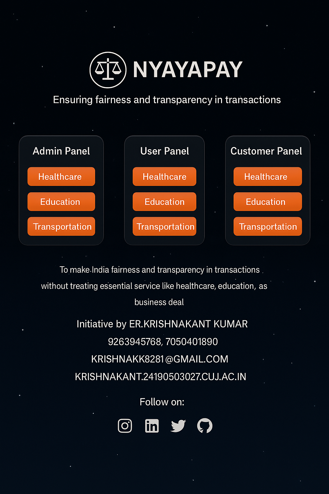

# Nyayapay - Fair & Transparent Transactions  

## Website Link :- https://krishnakant1794.github.io/NYAYAPAY/

## Overview
Nyayapay is a platform dedicated to ensuring **fairness and transparency in transactions** without treating essential services like **healthcare, education, and transportation** as business deals. The website provides an interactive, **3D-animated** experience with dynamic background effects, intuitive navigation, and multiple user panels for easy access.

## Features
- **3D Animated Twinkling Star Background** for an immersive experience.
- **Admin Panel, User Panel, and Customer Panel** with dedicated buttons for:
  - Healthcare Department
  - Education Department
  - Transportation Department
- **3D Rotation & Light Hover Effects** for interactive buttons.
- **Responsive Design** for seamless experience across devices.
- **Nyayapay Logo** designed for brand identity.
- **Admin Contact Details** displayed at the bottom.
- **Social Media Integration** with interactive icons for:
  - Instagram
  - LinkedIn
  - Twitter
  - GitHub

## Technologies Used
- **HTML** for structuring the webpage.
- **CSS** for styling, animations, and 3D effects.
- **JavaScript** for dynamic interactions and star animation.
- **FontAwesome** for social media icons.

## Installation & Usage
1. Clone the repository:
   ```sh
   git clone https://github.com/krishnakant1794/NYAYAPAY.git
   ```
2. Navigate to the project directory:
   ```sh
   cd NYAYAPAY
   ```
3. Open `index.html` in a web browser.

## File Structure
```
Nyayapay/
│── index.html       # Main HTML file
│── styles.css       # Stylesheet for the website
│── script.js        # JavaScript for animations
│── logo.png         # Nyayapay logo
│── README.md        # Documentation
```

## Screenshots


## Future Enhancements
- User authentication for role-based access.
- Transaction tracking system.
- AI-driven transparency analytics.

## Contact
- **Initiative by:** ER. Krishnakant Kumar
- **Contact:** 9263945768, 7050401890
- **Email:** krishnakk8281@gmail.com, krishnakant.24190503027.cuj.ac.in

## Follow Us
[](https://instagram.com/yourprofile)
[](https://linkedin.com/in/yourprofile)
[](https://twitter.com/yourprofile)
[](https://github.com/yourprofile)

## License
This project is licensed under the **MIT License**. Feel free to contribute and improve the platform!

---

*"To make India fair and transparent in transactions without treating essential services like healthcare, education, as business deals."*
